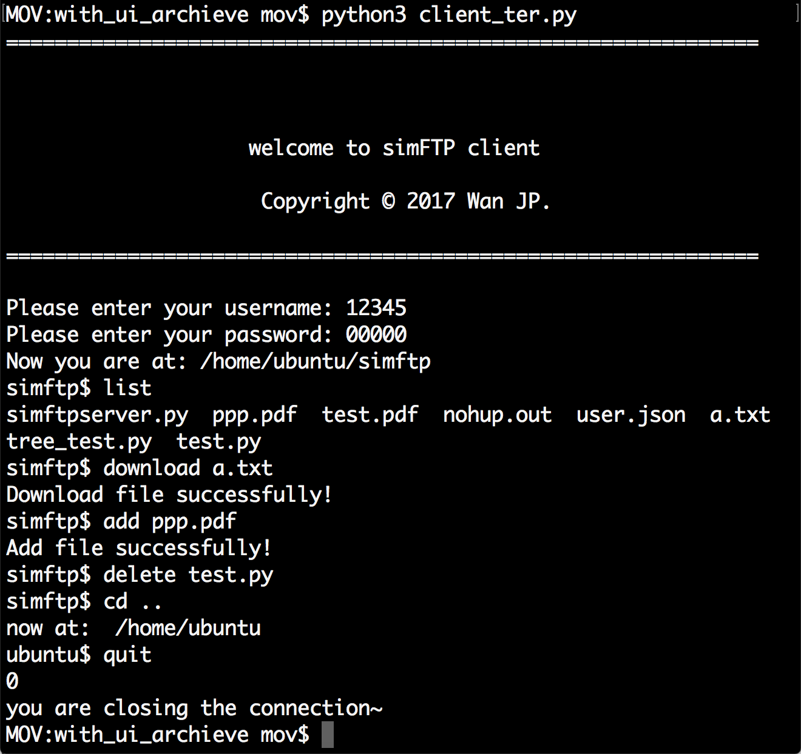
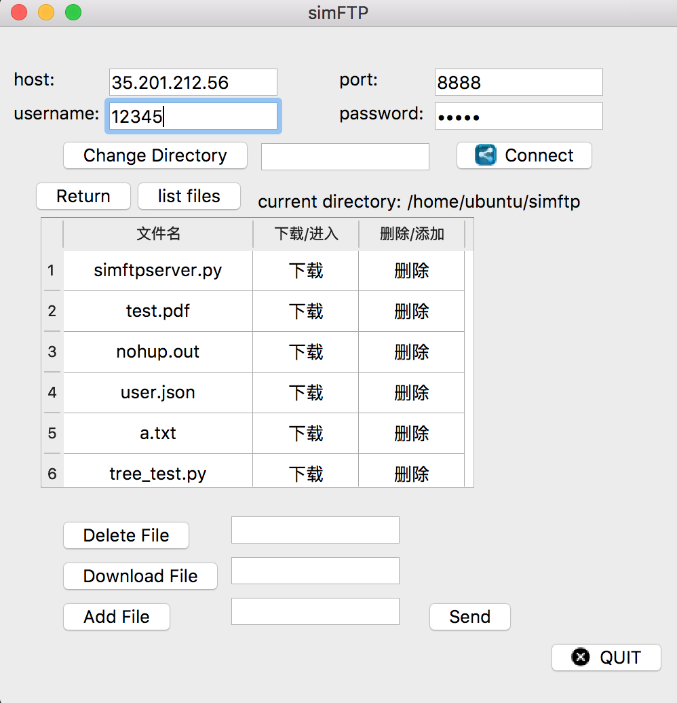
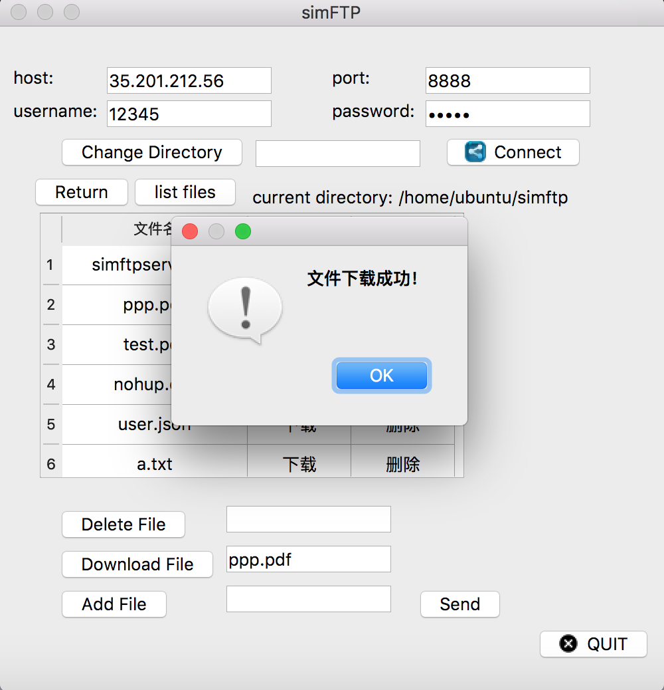

# 简化版FTP协议实现————simFTP

## 一、简介：
  + 设计了简化版FTP协议-“simFTP”，基于此协议实现了客户端和服务端。
  + 服务端：python3实现，多进程支持多个客户端访问。
  + 客户端有两个：终端模式用python3实现，GUI模式用python3和pyqt5实现。
  + 主要功能如下：
    - 1.更改目录
    - 2.显示当前目录文件
    - 3.下载文件
    - 4.添加文件
    - 5.删除文件

## 二、“simFTP”协议设计
- 报文共三种格式：客户端请求报文、服务端应答报文、数据传输报文。     
- 添加文件和下载文件时, 使用请求和应答报文协商文件名称及大小，然后数据用传输报文传输。  
- 其余命令不涉及大型文件，故直接使用请求和应答报文传输。

#### 1.客户端请求报文

###### 格式(括号内数字为字节长度)  
    报文长度(3) + 命令(3)+ 参数A长度(3)+ 参数A+ 参数B长度(3)+参数B+报文数目(3)+报文编号(3)+数据

###### 命令编号如下：
  + 000: 获取当前目录的文件  
  + 001: 更改目录    参数A：文件夹名
  + 002: 添加文件    参数A：文件名
  + 003: 删除文件    参数A：文件名
  + 004: 下载文件    参数A：文件名
  + 005: 关闭连接
  + 006: 获取当前目录信息
  + 007: 登录   参数A：用户名 参数B：密码

#### 2.服务端应答报文
###### 格式(括号内数字为字节长度)     
    报文长度(3)+状态码(3)+ 包总数(3)+ 序号(3)+ command(3)+ 数据

###### 状态码类别：
+ 100：正确
+ 200：错误(传输类)
+ 201：错误(系统类错误：无法打开文件、文件名不存在、文件夹错误、无权限删除添加或下载文件、用户名和密码错误)

#### 3.数据传输报文
###### 格式(括号内数字为字节长度)     
    报文长度(3)+数据

##三、使用说明及截图：
##### 1.服务端：
      服务端已经放在服务器上，地址：35.201.212.56，端口号：8888。
      终端客户端默认连接此地址和端口。GUI默认输入为这个地址和端口
##### 2.终端客户端
###### 使用说明：
+ 输入用户名和密码（用户信息由服务端维护，目前可以使用{'anonymous':'', '12345':'00000', '00000':'00000'}）
+ 可输入命令如下:
      -  list
      -  add <filename>
      -  delete <filename>
      -  download <filename>
      -  cd <directory name>
      - quit(终止连接并退出)
      - exit(强行退出)
###### 截图
<!--  -->

##### UI客户端：
###### 使用说明：
+ 输入用户名密码，地址端口号后，先点击“Connect”与服务器连接并登陆。
+ 其余按钮中，“Add File”可在本机的文件系统查找文件
###### 截图

<!-- 
 -->

## 四、问题及改进
  +  编码及解码处理不完善，显示文件名时，中文名称的文件显示时部分乱码。原因是接收端部分文字不能正确解码。解决方案是，继续研究编码格式的问题，改进传输时编码的方案。
  +  GUI用户体验不够好。解决方案为展示服务器文件的时候，使用PyQt5的TreeView组件，将文件树展示出来，用户体验会改善很多
  +  后续可以支持“文件夹下载”和“空文件夹删除”功能，并根据用户限制权限。
## 五、提交各部分作用
+ server.py: 服务端
+ client.py: GUI调用的客户端类
+ client_ui.py: GUI客户端
+ client_ter.py: 终端版客户端
+ conn.png,close.png: GUI客户端按钮使用的图标
+ 实验报告，即本文件

